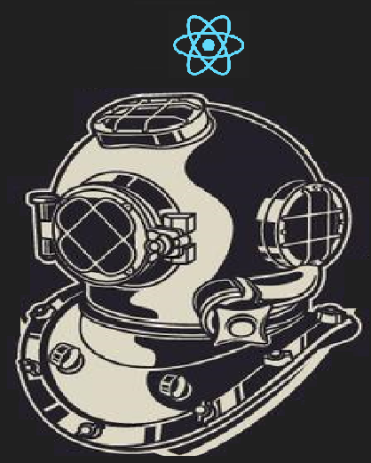

# Devflix


<p>
  
</p>

> Project done during a study marathon - React


## How run the project?

After download the project, access it via your terminal and run the commands:

```sh
npm install
npm run dev
```


