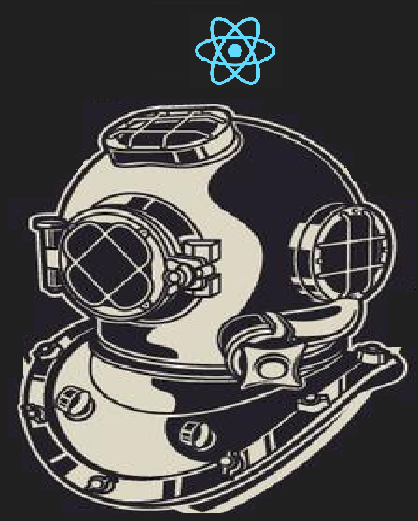

# Devflix

  

> React project developed as part of a front-end development study program.

## Running the project locally

After cloning the repository, navigate to the project directory and run:

npm install
npm run dev

## Live Demo

The original version of the project is available on Vercel:

https://devflix-react-seven.vercel.app/
